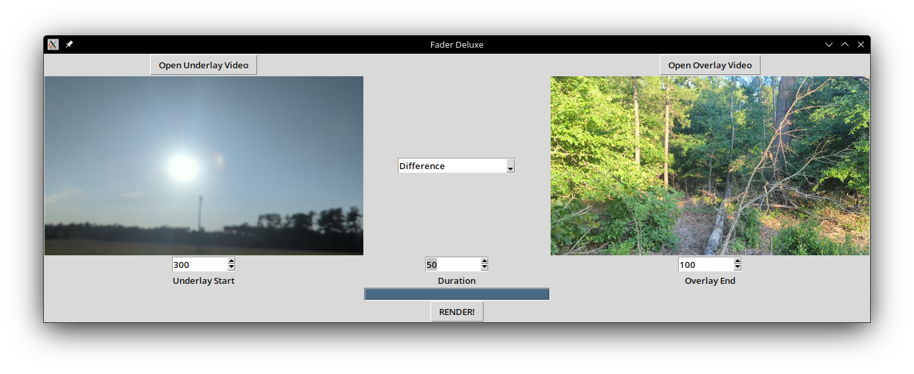

# FaderDeluxe
FaderDeluxe is a cool video fade generator with a few presets that lets you generate fading transitions between video clips


### Usage
---

Firstly, make sure you have ffmpeg + ffprobe installed

```sudo dnf install ffmpeg ffprobe```

Secondly, make sure that you have the deps installed
```pip install -r requirements.txt```

Finally, you can run it with

```python fader.py```
